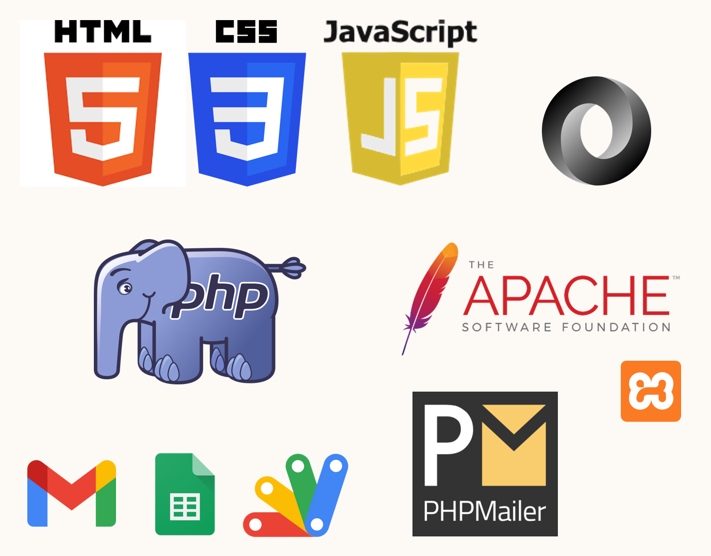

# Aikyam Web Application

Magazines generally act as a great source of current affairs, information hub and a log of timely updates. They also ignite creativity in the students and could inspire peers to contribute more towards the same. But for promoting the readability and availability of magazines, a dynamic, user-friendly web application is required to provide 24/7 accessibility to these magazines in a secure manner. Aikyam Web Application serves as a medium for this purpose

 

## Objectives

The objectives of the project are :

* Enhance visibility and increase the availability of the magazines to students
* Ease of access to constitute a wider range of audience
* Convenience of reading through E-book facility
* Incorporate interactive features to enhance user experience and engagement
* Act as an archive for the magazines

 

## Technological stack

 

## Important Features

1. OTP based Authentication
2. Session Tracking
3. Get in Touch
4. Interactive Flipbook
5. Display History, Members and current Events